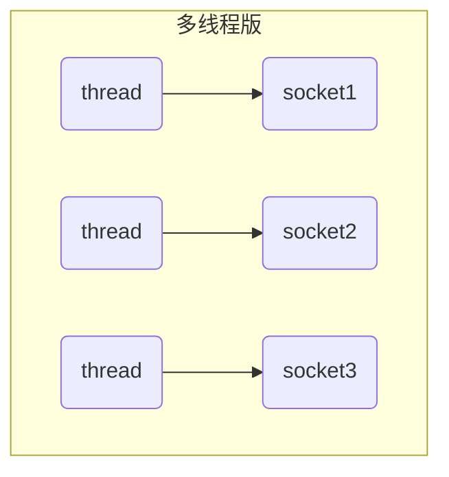
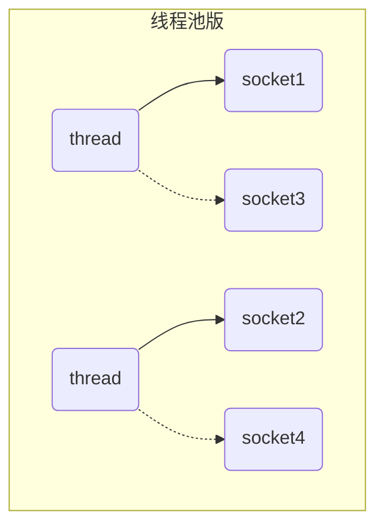
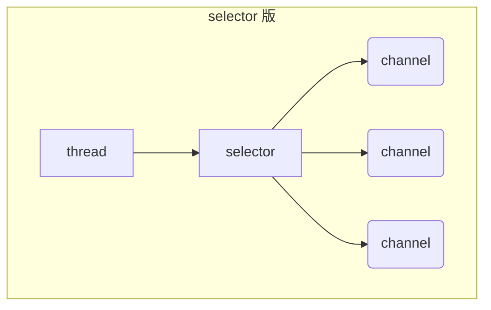

## 1. 三大组件

### 1.1 Channel & Buffer

channel 有一点类似于 stream，它就是读写数据的**双向通道**，可以从 channel 将数据读入 buffer，也可以将 buffer 的数据写入 channel，而之前的 stream 要么是输入，要么是输出，channel 比 stream 更为底层

常见的 Channel 有

* FileChannel——文件
* DatagramChannel——UDP
* SocketChannel——TCP（客户端+服务器端）
* ServerSocketChannel——TCP（服务器端）

buffer 则用来**缓冲读写数据**，常见的 buffer 有

* ByteBuffer——抽象类，下面是三种实现类
  * MappedByteBuffer
  * DirectByteBuffer
  * HeapByteBuffer
* ShortBuffer（支持的不同类型的缓冲区，了解即可）
* IntBuffer
* LongBuffer
* FloatBuffer
* DoubleBuffer
* CharBuffer

### 1.2 Selector（选择器）

selector 单从字面意思不好理解，需要结合服务器的设计演化来理解它的用途

#### 多线程版设计

#### ⚠️ 多线程版缺点

* 内存占用高
* 线程上下文切换成本高
* 只适合连接数少的场景

#### 线程池版设计

#### ⚠️ 线程池版缺点

* **阻塞模式下**，线程仅能处理一个 socket 连接（socket没断开之前，不能处理其他的）
* 仅适合短连接场景（适合http的请求）

#### selector 版设计

selector可以监测到所有channel

selector 的作用就是配合一个线程来管理多个 channel，获取这些 channel 上发生的事件，这些 channel 工作在**非阻塞模式**下，不会让线程吊死在一个 channel 上。适合连接数特别多，但流量低的场景（low traffic）

调用 selector 的 select() 会阻塞直到 channel 发生了读写就绪事件，这些事件发生，select 方法就会返回这些事件交给 thread 来处理

